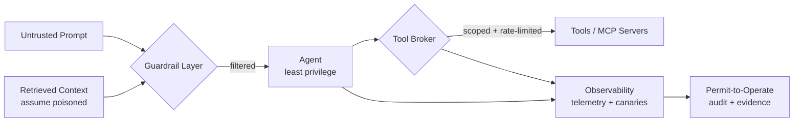

<a href="https://ibrahimsaleem.com">
  
</a>

<p align="center">
  <a href="https://git.io/typing-svg">
    
  </a>
</p>

<p align="center">
  <a href="https://ibrahimsaleem.com"></a>
  <a href="https://linkedin.com/in/ibrahimsaleem91"></a>
  <a href="https://scholar.google.com/scholar?q=%22Mohammad+Ibrahim+Saleem%22"></a>
  <a href="mailto:Ibrahimsaleem244@gmail.com"></a>
</p>

<p align="center">
  
  
  
  
</p>


## 🧭 About Me

<table>
<tr><td width="60%" valign="top">

**AI Security & Governance Engineer** securing enterprise-scale **LLM, GenAI, MCP, and agentic AI systems**.

I work across **AI threat modeling, adversarial testing, red teaming, secure AI SDLC, AI governance, and runtime security controls** — turning ad-hoc AI risk work into repeatable, measurable, auditable engineering.

**Risk focus:** prompt injection · jailbreaks · tool poisoning · sensitive data leakage · excessive agency · insecure MCP servers · unsafe RAG · missing runtime controls

</td><td width="40%" valign="top">

```text
» prompts        = untrusted input
» retrieved ctx  = assume poisoned
» agents         = least privilege
» tool use       = monitored at runtime
» every decision = auditable evidence
```

</td></tr>
</table>


## 📊 Impact by the Numbers

| Metric | Result | Where |
|---|---|---|
| AI use-case review & permit-to-operate | **10–12 days → under 6 min** (automated agentic review pipeline) | AT&T |
| LangGraph governance pipeline audit | **29 issues / 7 runs** — incl. critical *fail-open* ("APPROVED" regardless of logic) | AT&T |
| LLM red-team harness | **415 adversarial prompts**, full OWASP LLM Top 10, MITRE ATT&CK, CI regression gate | AT&T |
| Enterprise AI security controls authored | **42 controls / 9 categories** (incl. voice-agent controls) | AT&T |
| "Contact Us" GenAI automation | **20+ hrs/week saved**, 0 critical vulns, 50+ emails/day @ 95% accuracy | NOV |
| Self-improving MUD report parsing | **360× faster** (8 min vs 2 days), 89–100% accuracy, 0 incidents | NOV *(SPE 2026)* |
| LIMA pentest framework | **95% success rate**, 8+ hrs → 15 min | UH *(IEEE FMLDS 2025)* |
| PentestThinkingMCP | **90% accuracy / 50+ scenarios**, HTB "Lame" in 3 min @ ~$0.03/run | UH |
| LLM vs. expert pentesters benchmark | **12/15 HTB boxes**, ~95% cost reduction | UH |


## 💼 Experience

<details open>
<summary><b>🛡️ AI Security &amp; Governance Engineer — AT&amp;T</b> · Plano, TX (Hybrid) · <i>Jan 2026 – Present</i></summary>

<br>

- Designed and secured enterprise **AI governance / permit-to-operate** workflows for GenAI and agentic systems on Azure (Key Vault, Managed Identities, Defender for Cloud, Azure OpenAI).
- Led a manual security audit of a **15-node LangGraph** governance pipeline — uncovered 29 issues incl. a critical fail-open defect; delivered a peer-validated remediation plan.
- Built a **provider-agnostic LLM red-team harness** — 415 adversarial prompts, OWASP LLM Top 10, MITRE ATT&CK scenarios, LLM-as-judge + canary detection, MAP-Elites landscape, CI regression gate; authored **Sigma** rules and monitored runs in **Splunk ES**.
- Ran multi-phase adversarial testing / red teaming (250+ prompts) on advanced enterprise LLM & agentic systems pre-deployment.
- Built **privacy-preserving tokenization & masking** for enterprise networking data (IPs, VLANs, infra metadata) preserving topology + semantics.
- Authored **42 AI security controls / 9 categories** feeding the supplier AI requirements framework; contributed to an enterprise **agentic-security control plane** (AI observability/telemetry, LangGraph workflow design) aligned with zero-trust, NIST AI-RMF, secure AI SDLC.

</details>

<details>
<summary><b>🤖 GenAI &amp; Data Science Intern — NOV Inc. (National Oilwell Varco)</b> · Houston, TX · <i>Jun 2025 – Dec 2025</i></summary>

<br>

- **Contact Us AI Automation & Email Responder** — routing engine grounded in Azure AI Search-indexed content; threat-modeled against direct/indirect prompt injection & jailbreak per OWASP LLM Top 10 + Agentic AI Threat Modeling. 0 critical vulns, 100% compliance, 50+ emails/day.
- **Self-Improving MUD Report Automation** *(SPE 2026 – accepted)* — 3-agent GenAI system (vendor detection → prompt optimization → extraction) on Azure OpenAI via Azure AI Foundry, eval DB + job pipeline on Databricks. 89–100% accuracy, 360× speedup.
- **Secured MCP Server for Expression Language conversion** — mitigated command injection (RCE), weak auth, missing rate limits, tool poisoning; fine-tuned a Code-Llama 8B model; enabled secure EL conversion for 5+ internal tools.
- Consulted data scientists / automation engineers on secure agentic coding and tested their AI solutions.

</details>

<details>
<summary><b>🔬 Research Assistant – AI &amp; Cybersecurity — University of Houston</b> · Houston, TX · <i>Sep 2024 – May 2025</i></summary>

<br>

- Pioneered **LIMA** (first author) — LLM-driven, MCP-based penetration-testing framework; 95% success rate, 8+ hrs → 15 min.
- Engineered **PentestThinkingMCP** — reasoning agents + Nmap / Metasploit / Burp Suite across 50+ scenarios (90% accuracy); secured with prompt-injection defenses, I/O validation, rate limiting. [Live](https://smithery.ai/server/@ibrahimsaleem/pentestthinkingmcp)
- Established a quantitative benchmark: Claude 3.5 outperformed expert pentesters on 12/15 HTB boxes (~$0.05/run). Authored **IEEE FMLDS 2025** paper.

</details>

<details>
<summary><b>💻 Associate Software Engineer — Nagarro Software Pvt. Ltd.</b> · <i>Mar 2023 – Feb 2024</i></summary>

<br>

- Built secure .NET Core (C#) / SQL Server backend + React frontend for a **banking client** — secure coding, input validation, SQLi prevention, query optimization (30%) across 25+ APIs.
- Delivered secure REST APIs with JWT, RBAC, OWASP compliance — 1000+ daily requests, 99.9% uptime across 6+ apps.

</details>


## 🚀 Featured Projects

| Project | What it does | Focus / Stack |
|---|---|---|
| [**PentestThinkingMCP**](https://github.com/ibrahimsaleem/PentestThinkingMCP) 📌 | AI-powered pentest reasoning engine (MCP server) for attack-path planning, CTF/HTB solving, automated workflows | MCP · Beam Search · MCTS · Metasploit/Nmap/Burp — *IEEE paper* |
| [**ClawProtect**](https://github.com/ibrahimsaleem/ClawProtect) 📌 | Defense-in-depth reverse proxy for AI agent gateways — inspects requests/responses for prompt injection, PII leaks, malware | Go · eBPF syscall monitoring · egress firewall |
| [**EncoderThinkingMCP**](https://github.com/ibrahimsaleem/EncoderThinking) 📌 | MCP server guiding LLMs through encoder-decoder ML training via Beam Search + MCTS | MCP · PyTorch/TensorFlow/Keras — *IEEE Southwest 2026* |
| [**TokenLess / TokenWatch**](https://github.com/ibrahimsaleem/TokenLess) 📌 | Token-optimization hub + dependency-free local LLM cost-tracking library | Python · LiteLLM gateway · guardrails · prompt compression |
| [**UltraSearch**](https://github.com/ibrahimsaleem/ultrasearch) 📌 | Lightning-fast laptop-wide RAG search built on LEANN vector DB | Python · Streamlit · Sentence Transformers · FAISS/HNSW |
| [**LLM Red-Team Library**](https://github.com/ibrahimsaleem) | Provider-agnostic red-team harness — 415 adversarial/bias/hallucination prompts, MAP-Elites landscape, CI regression suite | Python · OWASP LLM Top 10 · LLM-as-Judge |
| [**LocalRAGAgent**](https://github.com/ibrahimsaleem/LocalRAGAgent) | Offline, privacy-preserving RAG pipeline | Python · on-prem LLM |
| [**ML DDoS Detection**](https://github.com/ibrahimsaleem/ML-DDOS-Detection-Project) | ML-based network monitoring & DDoS detection | Python · ML |


## 🛠️ Current Work Streams

> Active building threads — agent-security tooling, guardrails, and LLM cost control.

| Work Stream | What I'm building | Stack |
|---|---|---|
| [**Compass**](https://github.com/ibrahimsaleem/compass) | Multiplayer AI agent platform for orgs with the **Ward guardrail layer** — screens external data / tool results before the model, enforces command policy, human-approval gates, 3 postures (Strict / Auto / Dangerous) | TypeScript · Fastify · Postgres · Slack Bolt · Lit |
| [**saleem-harness**](https://github.com/ibrahimsaleem/saleem-harness) | Personalized agent-CLI fork with a **default-on preventive tool-call safety guard** that blocks unsafe tool executions before they run | TypeScript · pnpm workspace · plugin architecture |
| [**dsh-dashboard**](https://github.com/ibrahimsaleem/dsh-dashboard) | Local real-time observability dashboard for agent harnesses — token usage, cost, live tool calls, security-risk signals, straight from session logs | Node.js · Express · SSE |
| [**mcp-security-lab**](https://github.com/ibrahimsaleem/mcp-security-lab) | Runnable lab with **7 intentional MCP-server vulnerabilities** + fixed versions + working exploits, with a live WebSocket exploit dashboard | Python · FastMCP · Uvicorn |
| [**switchlane**](https://github.com/ibrahimsaleem/switchlane) / [**llm-cost-aware-routing**](https://github.com/ibrahimsaleem/llm-cost-aware-routing) | Cost-aware LLM request routing with a live chat UI showing per-message & per-session cost savings | Python · LLM routing |


## 📚 Research

| Paper | Venue | Status |
|---|---|---|
| **LIMA: Leveraging Large Language Models and MCP Servers for Initial Machine Access** — *first author* · [Paper](https://ieeexplore.ieee.org/abstract/document/11446751) | IEEE FMLDS 2025 | ✅ Published |
| **Self-Improving GenAI Agent for Fully Automated Report Parsing in Enterprise Environments** — *second author* · [Scholar](https://scholar.google.com/citations?user=lzZ4pKcAAAAJ&hl=en&oi=ao) | IADC/SPE 2026 | ✅ Published |
| **EncoderThinkingMCP: Guided Encoder-Decoder Model Development via MCP** — *w/ T. Banerjee* | IEEE Southwest 2026 | 🧪 Experiment phase |
| **Agentic Lean Embedding System for Vulnerability Discovery** — *lead researcher* | — | 🔬 Active research |
| **Auto ARC: AI-Powered Floor Plan Generation for Architectural Workflow Optimization** — *w/ M. Raza* | IEEE SoutheastCon 2026 | 📝 To be submitted |


## 🎓 Education

| Institution | Degree | Detail |
|---|---|---|
| **University of Houston** | M.S. Cybersecurity · *Expected May 2026* | GPA **3.98/4.0** · $16K scholarship |
| **Rajiv Gandhi Proudyogiki Vishwavidyalaya** | B.Tech, Computer Science Engineering | July 2023 |

<sub>Coursework: Network Security · Secure Enterprise Computing · Cryptography · Data Analysis for Cybersecurity · Cybersecurity Risk Management · Secure Software Design</sub>


## 🧰 Tech & Tooling

<p align="center">
  
  <br>
  
</p>

<table align="center">
<tr>
<td valign="top" width="50%">

**AI Security & Testing**
<br><br>
`Prompt Injection Defense` `Jailbreak Testing`
`AI Red Teaming` `MCP Security` `Secure RAG`
`MAP-Elites / Quality-Diversity`
`AI Observability (OTel / Arize)`
`Data Poisoning Mitigation`

**Governance & Frameworks**
<br><br>
`OWASP Top 10 for LLMs` `OWASP Agentic AI Threat Modeling`
`NIST AI-RMF` `ISO/IEC 42001` `Secure AI SDLC` `AI Lifecycle Mapping`

</td>
<td valign="top" width="50%">

**Security Tooling**
<br><br>
`Burp Suite` `Metasploit` `Nmap` `Wireshark`
`Splunk ES` `Sigma Rules` `Cortex XSOAR / XSIAM`
`Semgrep` `GitLeaks` `Trivy` `Prisma AIRS`

**AI / LLM Stack**
<br><br>
`LangChain` `LangGraph` `MCP` `Hugging Face`
`Ollama / Llama` `Azure OpenAI` `Azure AI Foundry`
`Azure AI Search` `Databricks`

</td>
</tr>
</table>

<p align="center">
  <b>Certifications:</b> OWASP Top 10 for LLMs · Security+ <i>(in progress)</i> · Azure AZ-900 · Azure AI-900 · ISC2 CC · Fortinet NSE 1–3
</p>


## 🔐 How I Think About AI Security




## 📈 GitHub Activity

<p align="center">
  
  
</p>

<p align="center">
  
</p>

<p align="center">
  
</p>

<picture>
  <source media="(prefers-color-scheme: dark)" srcset="https://raw.githubusercontent.com/ibrahimsaleem/ibrahimsaleem/output/snake-dark.svg" />
  <source media="(prefers-color-scheme: light)" srcset="https://raw.githubusercontent.com/ibrahimsaleem/ibrahimsaleem/output/snake.svg" />
  
</picture>

<p align="center">
  
</p>


## 🤝 Connect

<p align="center">
  <a href="https://ibrahimsaleem.com"></a>
  <a href="https://linkedin.com/in/ibrahimsaleem91"></a>
  <a href="https://scholar.google.com/scholar?q=%22Mohammad+Ibrahim+Saleem%22"></a>
  <a href="mailto:Ibrahimsaleem244@gmail.com"></a>
</p>

<p align="center">
  <i>Building secure AI systems means controlling what the model can see, what the agent can do,<br>what the tools can access, and what the enterprise can prove afterward.</i>
</p>


